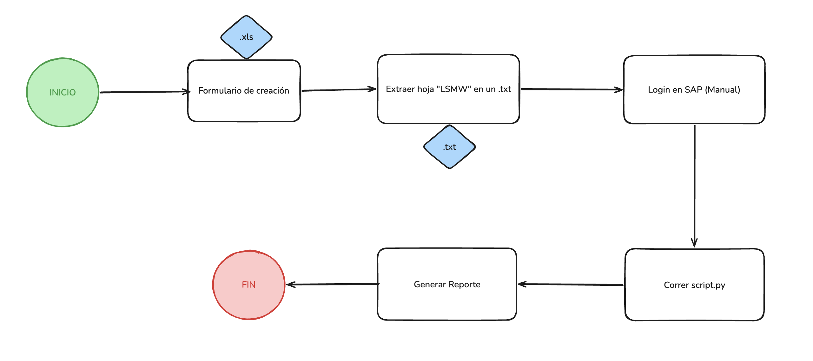

# Creación de Activos Fijos SAP

Aplicación de escritorio en Python que automatiza la **extracción de la hoja `LSMW`** desde el formato dinámico de creación y capitalización de activos fijos, generando un archivo `.txt` separado por tabulación listo para ser cargado en SAP mediante LSMW.

## Diagrama del proceso



El proceso completo contempla:

1. **INICIO** — el usuario diligencia el formulario de creación en el archivo Excel maestro (`Formato_Dinamico_.xlsx`).
2. **Formulario de creación** — captura de los datos del activo en la hoja `Formato`.
3. **Extraer hoja LSMW en un `.txt`** — *paso automatizado por esta app*: lee la hoja `LSMW` del Excel y la exporta como TSV en la carpeta `salida/`.
4. **Login en SAP** — paso manual realizado por el usuario.
5. **Correr `script.py`** — script encargado de cargar el archivo en SAP.
6. **Generar reporte** — documento con el resultado de la creación.
7. **FIN**.

> Esta aplicación cubre específicamente el paso 3 del flujo.

## Requerimientos

- **Python 3.9 o superior** con soporte para Tkinter (incluido por defecto en la mayoría de instalaciones; en macOS, el Python de Homebrew 3.12 **no** trae Tk, usa `python.org` o el del sistema).
- **openpyxl** (única dependencia externa).
- El archivo `resources/Formato_Dinamico_.xlsx` debe existir en la raíz del proyecto.

## Quick start

```bash
# 1. Clonar el repositorio
git clone https://github.com/santirogu/activos-propios-py.git
cd activos-propios-py

# 2. (Recomendado) Crear y activar un entorno virtual
python3 -m venv .venv
source .venv/bin/activate          # macOS / Linux
# .venv\Scripts\activate            # Windows

# 3. Instalar dependencias
pip install -r requirements.txt

# 4. Ejecutar la app
python main.py
```

Al abrirse la ventana, hacer clic en **"Extraer información en txt"**. El archivo resultante se guarda en `salida/LSMW_YYYYMMDD_HHMMSS.txt`.

## Cómo ejecutar la app

```bash
python main.py
```

La interfaz contiene un único botón. Al presionarlo:

- Lee la hoja `LSMW` de `resources/Formato_Dinamico_.xlsx`.
- Crea la carpeta `salida/` en la raíz del proyecto si no existe.
- Genera un archivo TSV con el patrón `LSMW_YYYYMMDD_HHMMSS.txt` (timestamp para no sobreescribir corridas previas).
- Muestra un mensaje de confirmación con la cantidad de filas exportadas.

### Notas sobre los datos exportados

La hoja `LSMW` está cableada con fórmulas que referencian la hoja `Formato`. `openpyxl` lee los valores que Excel **dejó cacheados** en el último guardado, por lo tanto:

- Si después de modificar el Excel quieres ver los nuevos valores en el TXT, **abre y guarda el Excel** antes de ejecutar la app (Excel recalcula y cachea las fórmulas al guardar).
- Las celdas referenciadas que estén vacías pueden aparecer como `0` (comportamiento estándar de Excel para referencias numéricas a celdas vacías).

## Cómo ejecutar las pruebas

Las pruebas usan `unittest` (incluido en la librería estándar, sin dependencias adicionales).

```bash
# Ejecutar toda la suite
python -m unittest tests.test_main -v

# Ejecutar un test específico
python -m unittest tests.test_main.ExportSheetToTsvTest.test_writes_tab_separated_content
```

### Cobertura de pruebas

La suite incluye 10 pruebas:

| Test | Qué valida |
|---|---|
| `test_writes_tab_separated_content` | Contenido exacto separado por tabulación |
| `test_none_values_become_empty_strings` | Celdas vacías (`None`) se convierten a string vacío |
| `test_creates_output_directory_if_missing` | Crea directorios anidados si no existen |
| `test_filename_has_timestamp_pattern` | Nombre de archivo con patrón `LSMW_YYYYMMDD_HHMMSS.txt` |
| `test_custom_file_prefix` | Permite configurar el prefijo del archivo |
| `test_missing_excel_raises_file_not_found` | Lanza excepción si el Excel no existe |
| `test_missing_sheet_raises_value_error` | Lanza excepción si la hoja no existe |
| `test_returns_row_count_matching_written_lines` | El contador de filas coincide con las líneas escritas |
| `test_does_not_overwrite_when_called_in_different_seconds` | Genera nombres únicos por timestamp |
| `test_extracts_lsmw_sheet_from_real_file` | Smoke test contra el Excel real del proyecto |

## Estructura del proyecto

```
.
├── main.py                          # App GUI + función pura export_sheet_to_tsv
├── requirements.txt                 # Dependencias (openpyxl)
├── README.md                        # Este archivo
├── docs/
│   └── flujo-proceso.png            # Diagrama del proceso completo
├── resources/
│   └── Formato_Dinamico_.xlsx       # Formato maestro con catálogos y plantilla
├── salida/                          # Carpeta generada automáticamente con los .txt
└── tests/
    └── test_main.py                 # Pruebas unitarias (unittest)
```

## Arquitectura del código

`main.py` separa la lógica en dos funciones:

- **`export_sheet_to_tsv(excel_path, sheet_name, output_dir, file_prefix="LSMW")`** — función pura que realiza la extracción y devuelve `(ruta_archivo, filas_escritas)`. Lanza `FileNotFoundError` si el Excel no existe y `ValueError` si la hoja no existe. Es la pieza testeable.
- **`extraer_lsmw_a_txt(status_var)`** — wrapper de GUI que invoca la función pura y traduce excepciones a diálogos de Tkinter (`messagebox`).

Esta separación permite probar la lógica sin necesidad de instanciar la interfaz gráfica.

## Hoja LSMW: contenido exportado

La hoja `LSMW` mapea las columnas del formulario a los **nombres técnicos de campos SAP**. El TXT generado contiene 51 columnas con campos como:

- `ANLKL` (Clase de activo fijo)
- `BUKRS` (Sociedad)
- `TXT50` (Denominación del activo fijo)
- `KOSTL` (Centro de costo)
- `WERKS` (Centro)
- `EAUFN` (Orden de inversión)
- `POSNR` (Elemento PEP)
- `ORD41`–`ORD44`, `GDLGRP` (Criterios de clasificación 1–5)
- entre otros.
