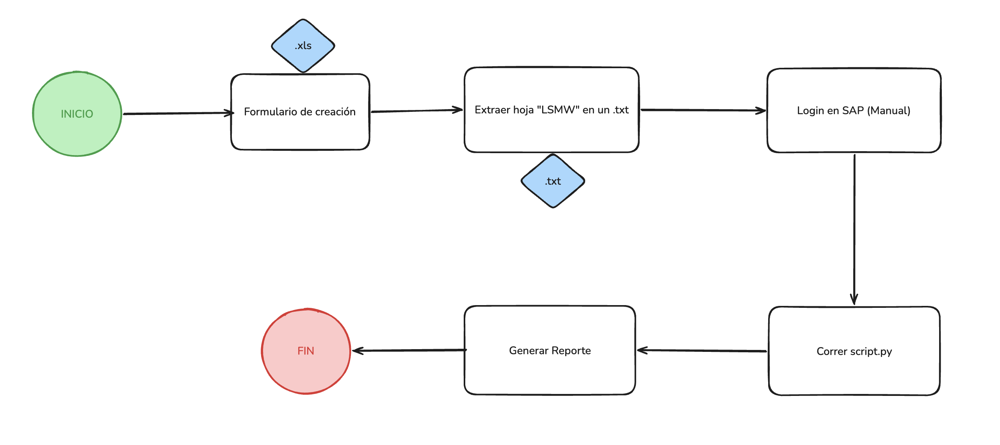

# Creación de Activos Fijos SAP

Aplicación de escritorio en Python que automatiza dos pasos del proceso de creación y capitalización de activos fijos en SAP:

1. **Extracción** de la hoja `LSMW` del formato dinámico Excel a un `.txt` separado por tabulación.
2. **Carga** de ese `.txt` a SAP vía la transacción LSMW, ejecutando el flujo completo (Specify Files → Read Data → Convert Data → Create BI Session → Run BI) mediante **SAP GUI Scripting**.

## Diagrama del proceso



El proceso completo contempla:

1. **INICIO** — el usuario diligencia el formulario de creación en el archivo Excel maestro (`Formato_Dinamico_.xlsx`).
2. **Formulario de creación** — captura de los datos del activo en la hoja `Formato`.
3. **Extraer hoja LSMW en un `.txt`** — *automatizado por el botón "Extraer información en txt"*.
4. **Login en SAP** — paso manual realizado por el usuario.
5. **Correr `script.py`** — *automatizado por el botón "Subir a SAP"* (ejecuta `src/sap_upload.py`).
6. **Generar reporte** — log de la sesión BDC visible en la transacción SM35.
7. **FIN**.

> Esta aplicación cubre los **pasos 3 y 5** del flujo. La autenticación en SAP (paso 4) sigue siendo manual.

## Requerimientos

- **Python 3.9 o superior** con soporte para Tkinter (incluido por defecto; en macOS, el Python de Homebrew 3.12 **no** trae Tk — usa `python.org` o el del sistema).
- **openpyxl** — manipulación del Excel (multiplataforma).
- **tkcalendar** — widget de calendario para los campos de fecha del Control SOX (multiplataforma).
- **Pillow** ≥ 10.0 — captura de pantalla para las evidencias IPE del Reporte SOX (multiplataforma; en Windows captura desktop completo incluyendo barra de tareas).
- **pywin32** — solo necesario para los botones "Subir a SAP" y "Generar Reporte SOX". Se instala automáticamente solo en Windows gracias al marcador `platform_system == "Windows"` en `requirements.txt`.
- El archivo `resources/Formato_Dinamico_.xlsx` debe existir.
- Para subir a SAP: SAP GUI for Windows abierto con sesión iniciada y `sapgui/user_scripting = TRUE` (ver sección "Configuración SAP" más abajo).

## Quick start

```bash
# 1. Clonar el repositorio
git clone <URL-DEL-REPO> activos-propios-py
cd activos-propios-py

# 2. (Recomendado) Crear y activar un entorno virtual
python3 -m venv .venv
source .venv/bin/activate          # macOS / Linux
# .venv\Scripts\activate            # Windows

# 3. Instalar dependencias
pip install -r requirements.txt

# 4. Ejecutar la app
python src/main.py
```

La ventana principal (título: "Gestión de Activos Fijos") muestra **3 cards horizontales del mismo ancho**:

- **Activos Fijos** — abre una sub-vista con `[Extraer información en txt]` y `[Creación de Activo]` (multiplataforma para extraer; Windows para SAP).
- **Control SOX** — abre una sub-vista intermedia con un botón `[HUB.PPE.01 Creación de Activos Fijos]` que lleva al formulario clásico de Sociedad + Desde + Hasta (Solo Windows).
- **Reportes** — placeholder deshabilitado, reservado para funcionalidades futuras.

Cada sub-vista tiene su propio botón "← Atrás" arriba a la izquierda para devolver al nivel anterior.

La GUI usa la **paleta corporativa Hub de ISA** (navy `#1A3A6C` + naranja `#F58220`, definida en [`src/branding.py`](src/branding.py)). El logo se carga desde `resources/logo_hub_isa.png` a 85px de alto (opcional — si el archivo no está, la GUI muestra sólo texto con colores).

## Cómo ejecutar la app

```bash
python src/main.py

```

### Card "Activos Fijos"

Reemplaza la vista del menú por un sub-formulario con tres botones:

#### "Extraer información en txt"

- Lee la hoja `LSMW` de `resources/Formato_Dinamico_.xlsx`.
- Crea la carpeta `salida/` en la raíz si no existe.
- **Si ya existe un `.txt` previo en `salida/`** muestra un diálogo SÍ/NO preguntando si reemplazarlo:
  - **SÍ** → borra los `.txt` existentes y genera uno nuevo.
  - **NO** → no hace nada, conserva el archivo existente.
- Si no hay archivos previos, genera directamente un TSV con el patrón `LSMW_YYYYMMDD_HHMMSS.txt`.
- Muestra confirmación con la cantidad de filas exportadas.

#### "Creación de Activo" (antes "Subir a SAP")

- **Arranca deshabilitado.** Se habilita automáticamente cuando detecta un `LSMW_*.txt` en `salida/` (polling cada 1 segundo, **scoped al frame** — se cancela al salir de la sub-vista). Si la carpeta queda vacía, vuelve a deshabilitarse.
- Pide confirmación antes de ejecutar (operación sensible que toma control de SAP).
- Toma el `.txt` más reciente de `salida/`.
- Conecta a la sesión SAP abierta vía SAP GUI Scripting (COM).
- Ejecuta el flujo LSMW completo: **configura dinámicamente la ruta del archivo en "Specify Files"** → Assign Files → Read Data → Display Read Data → Convert Data → Display Converted Data → Create Batch Input Session → Run Batch Input Session → Process BDC Session.
- El flujo corre en un hilo background, así la GUI no se congela.
- El status label muestra el progreso paso a paso.
- Al terminar, mostrar mensaje y sugerir revisar SM35.

También se puede ejecutar la carga sin GUI:

```bash
python src/sap_upload.py
```

#### "Extraer Activos Creados"

Tercer botón de la vista. Abre una sub-vista con:
- Campo **Usuario SAP** (Entry).
- Botón **Ejecutar**.

Al pulsar Ejecutar:
1. Valida que el Usuario SAP no esté vacío.
2. Pide confirmación al usuario.
3. Lanza un worker en background que (vía SAP GUI Scripting):
   - Abre la transacción **SM35P** (Monitor de logs BDC).
   - Filtra por el campo CREATOR con wildcard `*<USUARIO_SAP>`.
   - Abre el primer log de la tabla (F2 sobre la primera fila).
   - Exporta el detalle a `salida/ActivosCreados_<USUARIO>_<YYYYMMDD_HHMMSS>.xlsx`.
4. **Post-procesa el .xlsx en Python** (`procesar_logs`):
   - Renombra la hoja única (`Sheet1`) → `Logs`.
   - Crea una segunda hoja `Activos Fijos` con 2 columnas (`Activos Fijos`, `Subnúmero`).
   - Parsea la columna "Mensaje de log" con regex `act\.\s*fj\.\s+(\d+)\s+(\d+)` (case-insensitive) y extrae todos los pares `(activo, subnumero)` (ej. del mensaje `"El act.fj. 8048124 0 se ha creado"` extrae `8048124` y `0`).
   - Deduplica los pares preservando orden de primera aparición. Si el mismo activo aparece en varios mensajes del log, en la hoja `Activos Fijos` sólo aparece una vez.
5. Durante la ejecución, los botones Ejecutar y ← Atrás se deshabilitan.
6. Al terminar muestra messagebox con la ruta completa del archivo creado.

El path se fuerza inyectando `DY_PATH` y `DY_FILENAME` directamente en el diálogo "Save list as file" de SAP (saltando el F4/picker del recording), así el archivo siempre cae en `salida/` con el nombre estándar.

También se puede ejecutar sin GUI:

```bash
python src/extraer_activos_creados.py 1017209574
```

### Card "Control SOX"

Abre una sub-vista intermedia con un único botón **"HUB.PPE.01 Creación de Activos Fijos"**. Al pulsarlo, se abre el formulario clásico de parámetros SOX (Sociedad + Desde + Hasta) — el flujo sigue siendo el mismo que antes. Doble back devuelve al menú principal.

La estructura intermedia permite añadir en el futuro más opciones HUB.PPE.XX sin modificar el menú principal.

#### Formulario de parámetros (después del botón HUB.PPE.01)

Reemplaza la vista del intermedio por un formulario embebido en la misma ventana (no abre un Toplevel separado). Arriba a la izquierda aparece un botón **"← Atrás"** que devuelve al intermedio. El formulario sirve para generar el **Reporte SOX** desde SAP:

- **Sociedad** — selector desplegable (`Combobox` en estado `readonly`) con las opciones: `TRAN, ISA, ITCH, CEYBA, CABA, RPAE, CTMP, REPD, ISAP`. El usuario no puede escribir valores arbitrarios.
- **Desde** / **Hasta** — campos con **calendario emergente** (`DateEntry` de `tkcalendar`). El usuario puede elegir la fecha del calendario o escribirla a mano. Aún en escritura manual, el `validatecommand` restringe a dígitos y puntos (máx 10 caracteres). Formato `dd.mm.aaaa`.

Validaciones al presionar **"Generar Reporte SOX"**:
1. Sociedad debe estar en la lista permitida.
2. Ambas fechas deben tener formato `dd.mm.aaaa` válido.
3. `Hasta` debe ser `>=` `Desde`.

Si cualquier validación falla, se muestra un diálogo de error y no se ejecuta nada. Si todo es válido, se pide confirmación y el flujo SAP corre en un hilo background. Durante la ejecución del worker, tanto el botón **"Generar Reporte SOX"** como el **"← Atrás"** se deshabilitan (el usuario no puede volver al menú a mitad de un flujo SAP); ambos se re-habilitan al finalizar. Al terminar quedan **dos archivos** en `salida/`:

- **Intermedio** `SOX_<SOCIEDAD>_<YYYYMMDD_HHMMSS>.xlsx` — lo que SAP exportó vía `&XXL` del ALV grid.
- **Final / deliverable** `Población_<SOCIEDAD>_<FECHA_HASTA>.xlsx` — generado en Python con **tres hojas**:
  - `Original_SAP`: copia 1:1 del intermedio, celda por celda, preservando el `number_format` de cada una (Fecha `mm-dd-yy` y Hora `[$-F400]h:mm:ss\ AM/PM` se ven como en SAP, no con el ISO 24h default de openpyxl).
  - `Creados`: subconjunto de `Original_SAP` filtrado por `G == "*** creado ***"`, con la columna D (`AF <code>-<sub> <denom>`) descompuesta en `Activo Fijo` (int), `Subnúmero` (int) y `Identificación de objeto editada` (denominación, texto). Añade dos columnas como **fórmulas Excel en inglés** (estándar OOXML; Excel-ES las muestra como `EXTRAE` y `SI` en la barra de fórmulas, no valores pre-calculados): K = `=MID(D{n},1,2)` (primeros 2 dígitos del código, queda como texto), L = `=IF(K{n}="19","Intangible",IF(K{n}="20","Activo Construcción",IF(K{n}="14","Activo Construcción","PPE")))` (header `"PPE o Intangible"`). Las fórmulas se evalúan al abrir el archivo — si el usuario modifica D, K y L recalcularán. Bloque de observaciones explicativas en filas 1-9, headers en bold en fila 10, datos desde fila 11.
  - `IPE`: 5 capturas de pantalla embebidas como evidencia visual del proceso, en orden: (1) pantalla de Modificaciones con sociedad y fechas ingresadas antes de F8 (incluye barra de tareas de Windows), (2) primer registro de la tabla del grid AR15, (3) último registro (scroll al final via `grid.firstVisibleRow`/`RowCount`), (4) status bar SAP con los bytes exportados, (5) diálogo Propiedades del archivo SAP en Windows (los bytes deben coincidir con #4). Cada imagen lleva un título descriptivo encima y se escala a un ancho máximo de 1200 px. Las capturas se generan en un tempdir temporal durante el flujo SAP y se embeben aquí al final; el tempdir se limpia automáticamente. Si alguna captura falla (PIL ausente, diálogo Propiedades no abre, scroll del grid no funciona), se anota como "no disponible" sin romper el reporte (soft-fail).

  Es el nombre que el handler GUI muestra en el diálogo de éxito. Ejemplo: `Población_ISA_31.03.2026.xlsx`.

También se puede ejecutar desde CLI:

```bash
python src/sox_report.py ISA 01.05.2026 31.05.2026
```

### Debugging y logs

La función **"Test conexión SAP"** verifica el estado de la conexión SAP GUI sin ejecutar ningún flujo. Actualmente el botón **está oculto en la UI** (se conserva el código y el handler `_test_conexion_sap_handler` para reactivarlo en el futuro re-empaquetándolo en `main()`). Reporta qué encontró:

- pywin32 ausente
- SAP GUI no abierto / COM inaccesible
- Scripting Engine deshabilitado
- Sin conexiones / sin sesiones iniciadas
- Conexiones detectadas (con sistema/client/user de cada sesión)

Útil para diagnosticar cuando los botones "Subir a SAP" o "Generar Reporte SOX" fallan en la conexión.

La app imprime logs con timestamp `[HH:MM:SS]` cada vez que se presiona un botón, describe lo que está haciendo (validaciones, archivos previos, extracción, etc.). Para verlos en tiempo real, ejecutar desde un terminal:

```bash
python src/main.py
```

Si algo falla inesperadamente (permisos, archivo bloqueado en Excel, IDs SAP que no calzan), la app:
- Muestra un diálogo con el tipo de error y el traceback completo.
- Imprime el traceback en consola para diagnóstico detallado.

#### Apartamento COM en threads de SAP

Los workers de "Subir a SAP" y "Generar Reporte SOX" corren en threads de background. Windows exige `pythoncom.CoInitialize()` antes de cualquier llamada COM desde un thread que no sea el main — sin esto, `GetObject('SAPGUI')` falla con un error genérico aunque SAP esté abierto.

La app incluye un context manager `_sap_com_apartment()` que inicializa el apartamento COM al entrar al worker y lo libera al salir. Esto es transparente para el usuario pero clave si Windows/pywin32/políticas corporativas exigen el chequeo (en algunos entornos pasa, en otros parece funcionar sin ello).

Esto aplica tanto para excepciones manejadas (`FileNotFoundError`, `ValueError`, `OSError`) como para cualquier error no previsto — gracias a un handler global de excepciones de Tkinter (`root.report_callback_exception`).

### Notas sobre los datos exportados

La hoja `LSMW` está cableada con fórmulas que referencian la hoja `Formato`. `openpyxl` lee los valores que Excel **dejó cacheados** en el último guardado, por lo tanto:

- Si después de modificar el Excel quieres ver los nuevos valores en el TXT, **abre y guarda el Excel** antes de ejecutar la app (Excel recalcula y cachea las fórmulas al guardar).
- Las celdas referenciadas que estén vacías pueden aparecer como `0` (comportamiento estándar de Excel para referencias numéricas a celdas vacías).

## Configuración SAP (una sola vez por máquina)

Para que el botón "Subir a SAP" funcione:

1. **Cliente** — habilitar scripting en SAP GUI:
   *Options → Accessibility & Scripting → Scripting → "Enable scripting"*. Recomendado desmarcar los dos "Notify when..." para experiencia desatendida.
2. **Servidor** — parámetro `sapgui/user_scripting = TRUE` (transacción RZ11). Si no está habilitado, pídele al equipo Basis que lo active.
3. **Iniciar sesión SAP** antes de presionar el botón. El script no autentica.
4. **Pre-cargar el proyecto LSMW** — abrir LSMW manualmente al menos una vez con Subproject + Object correctos. SAP recuerda la última selección.

> **La ruta del archivo en LSMW ya no requiere configuración manual.** El script ahora la inyecta dinámicamente en cada corrida apuntando al `.txt` más reciente de `salida/`, replicando la grabación VBS de `resources/Script1.vbs`.

## Cómo ejecutar las pruebas

Las pruebas usan `unittest` (incluido en la librería estándar, sin dependencias adicionales).

```bash
# Toda la suite
python -m unittest discover tests -v

# Solo el módulo principal
python -m unittest tests.test_main -v

# Solo el módulo de carga SAP
python -m unittest tests.test_sap_upload -v

# Un test específico
python -m unittest tests.test_main.SubirASapTest.test_worker_calls_full_flow_on_happy_path
```

### Cobertura de pruebas

La suite contiene **226 pruebas** distribuidas en tres archivos:

#### `tests/test_main.py` (75 pruebas)

**`ExportSheetToTsvTest`** (9 pruebas) — lógica pura de extracción TSV: contenido tab-separated, manejo de `None`, creación de directorios, patrón de timestamp, prefijo configurable, errores de archivo/hoja faltantes, contador de filas, no-overwrite por timestamp.

**`RealWorkbookSmokeTest`** (1 prueba) — smoke test contra el Excel real del proyecto.

**`ExtraerLsmwATxtTest`** (7 pruebas) — handler del botón "Extraer información en txt":

| Test | Qué valida |
|---|---|
| `test_proceeds_directly_when_no_existing_txt` | Sin archivos previos → no pregunta, extrae directamente |
| `test_asks_for_replacement_when_txt_exists` | Con archivo previo → muestra diálogo con el nombre del archivo |
| `test_yes_deletes_existing_and_creates_new` | SÍ → borra el .txt previo y llama a `export_sheet_to_tsv` |
| `test_yes_deletes_all_existing_txt_files` | SÍ con múltiples archivos previos → borra todos |
| `test_no_keeps_existing_and_does_not_extract` | NO → no borra, no extrae, no muestra mensaje de éxito |
| `test_no_updates_status_with_cancellation_message` | NO → status_var con texto de cancelación |
| `test_ignores_non_lsmw_files_when_checking_existing` | Archivos que no son `LSMW_*.txt` no disparan el diálogo |

**`ExtraerLsmwATxtErrorPathsTest`** (4 pruebas) — verifica que toda excepción durante la extracción se muestra al usuario: `FileNotFoundError` (Excel ausente), `ValueError` (hoja ausente), excepción genérica del export, y la red de seguridad para errores inesperados (ej. `OUTPUT_DIR.glob` falla por permisos) que muestra el traceback en el diálogo.

**`ShowUnexpectedErrorTest`** (1 prueba) — `_show_unexpected_error` muestra messagebox con tipo, mensaje y traceback completo de la excepción.

**`InstallTkExceptionHandlerTest`** (2 pruebas) — `_install_tk_exception_handler` reemplaza `root.report_callback_exception`; al invocar el handler se muestra un diálogo en vez de imprimir silenciosamente a stderr.

**`HayTxtEnSalidaTest`** (4 pruebas) — detección de `.txt` en `salida/`: directorio inexistente, vacío, con `LSMW_*.txt`, con archivos no-LSMW.

**`RefrescarEstadoBotonSubirTest`** (3 pruebas) — habilita/deshabilita el botón "Subir a SAP" según presencia de `.txt`; respeta el flag `_upload_en_curso` para no interferir con el worker.

**`PollEstadoBotonSubirTest`** (1 prueba) — el polling refresca y se re-programa cada `_POLL_INTERVAL_MS`.

**`SubirASapFlagTest`** (5 pruebas) — gestión correcta del flag `_upload_en_curso`: True durante el worker, False tras éxito o error, no se setea si el usuario cancela, botón queda disabled si `salida/` queda vacía tras el upload.

**`ControlSoxDialogTest`** (9 pruebas) — `control_sox(root, frame_menu)` oculta el menú y muestra un `frame_sox` embebido en `root` (no Toplevel). Expone Combobox con valores válidos + readonly, StringVars del formulario, el botón "← Atrás" y verifica que al pulsarlo el `frame_sox` se destruye y el `frame_menu` vuelve a pack. Los campos Desde/Hasta son `DateEntry` (calendario emergente) que escriben en formato `dd.mm.aaaa` e inicializan con la fecha actual.

**`GenerarReporteSoxHandlerTest`** (10 pruebas) — handler del botón "Generar Reporte SOX": validación de sociedad, formato de fecha, rango fechas, cancelación, happy path con normalización de sociedad, gestión del estado del botón Generar y del botón Atrás (ambos deshabilitados durante el worker, re-habilitados al final), y manejo de errores en el worker (SAP no disponible, flujo falla, contexto COM apartment).

**`SubirASapTest`** (11 pruebas) — handler del botón "Subir a SAP":

| Test | Qué valida |
|---|---|
| `test_cancel_confirmation_does_not_start_thread` | Cancelar el diálogo no lanza el worker |
| `test_cancel_does_not_modify_status` | Cancelar no toca `status_var` |
| `test_confirmation_disables_button_before_starting_worker` | Botón deshabilitado antes del thread |
| `test_worker_calls_full_flow_on_happy_path` | `get_latest_txt` + `get_sap_session` + `run_lsmw_flow(session, carpeta, nombre)` |
| `test_worker_reenables_button_after_success` | Tras éxito el botón vuelve a `normal` |
| `test_worker_updates_status_to_completion_message` | Status final contiene "completada" |
| `test_worker_passes_folder_and_filename_to_run_lsmw_flow` | Carpeta y nombre del .txt llegan correctos al flujo |
| `test_worker_handles_missing_txt` | `FileNotFoundError` → error, botón se reactiva |
| `test_worker_handles_sap_connection_error` | `RuntimeError` SAP → error, botón se reactiva |
| `test_worker_handles_lsmw_flow_error` | Excepción del flujo → error, NO muestra info de éxito |
| `test_worker_resets_status_on_error` | `status_var` se vacía tras error |

#### `tests/test_sox_report.py` (105 pruebas)

| Clase | Tests | Cobertura |
|---|---|---|
| `ValidarSociedadTest` | 6 | Acepta valores válidos, normaliza a uppercase, rechaza inválidos/vacíos/no-string |
| `ValidarFechaTest` | 7 | Acepta formato correcto, rechaza otros formatos, día/mes inválido, vacío, alfabético |
| `ValidarRangoFechasTest` | 5 | `desde < hasta`, `desde == hasta`, rechaza `hasta < desde`, propaga errores de formato |
| `ValidarCaracterFechaTest` | 4 | Per-keystroke: acepta dígitos/puntos, rechaza letras/símbolos/más-de-10-chars |
| `GetSapSessionTest` | varios | pywin32 ausente, devuelve sesión OK |
| `AbrirTransaccionSoxTest` | varios | T-code AR15 + fallback árbol |
| `IngresarParametrosTest` + `SeleccionarFechaCalendarioTest` | varios | P_BUKRS + S_DATUM-LOW/HIGH vía calendario F4 + F8 |
| `ExportarAExcelTest` | 9 | `pc_list` vs `alv_grid` vs `None`, fill DY_PATH/DY_FILENAME, `btn[0]` para PC, `btn[11]` para ALV, rechaza método inválido |
| `StepErrorContextTest` | varios | Re-raise con contexto cuando algún paso SAP falla |
| `GenerarReporteSoxTest` | 7 | Orden de los 5 pasos (incluye `poblacion`), normaliza sociedad, valida, devuelve nombre `Población_*`, `EXPORT_METHOD=None` salta paso post-SAP |
| **`GenerarXlsxPoblacionTest`** | 11 | Crea archivo con nombre estándar (`Población_{SOC}_{FECHA}.xlsx`), hoja `Original_SAP`, copia contenido, preserva datetime/numeric + `number_format` por celda (Fecha `mm-dd-yy`, Hora AM/PM), crea carpeta destino, normaliza fecha con whitespace, rechaza source missing / non-xlsx / fecha inválida |
| **`PatronAfRegexTest`** | 6 | Regex `^AF\s+(\d+)-(\d+)\s+(.+)$` parsea código + subnúmero + denominación; acepta múltiples espacios después de "AF", caracteres especiales y guiones en la denominación; rechaza prefijos distintos a "AF" y código no-numérico |
| **`GenerarHojaCreadosTest`** | 14 | Filter `*** creado ***` (exact match, case-sensitive), parseo de col D, headers en bold (fila 10, col L = `"PPE o Intangible"`), datos desde fila 11, columnas K y L como **fórmulas Excel en inglés** (`=MID(D{n},1,2)` y `=IF(...IF(...IF(...)))` anidado, con referencias por fila — Excel-ES las muestra como EXTRAE/SI al abrir), preserva `number_format` de Fecha/Hora, omite y cuenta filas que no matchean regex o tienen col D no-string, reemplaza hoja Creados existente (idempotente), valida que el workbook tenga `Original_SAP`, archivo source missing |
| **`EjecutarReporteTest`** | 2 | Split de F8: `ingresar_parametros` NO presiona F8 (`test_does_not_press_f8`); `ejecutar_reporte` SÍ lo hace y re-raise con contexto si btn[8] falta |
| **`GenerarHojaIpeTest`** | 8 | Crea la hoja IPE alongside Original_SAP+Creados; embebe los 5 screenshots cuando están todos; escribe título + descripciones; soft-fail cuando faltan capturas (anota "no disponible", reporta missing_names); soft-fail sin ninguna captura; replaza hoja IPE existente; escala imágenes wider que `IPE_IMAGE_MAX_WIDTH`; no escala imágenes pequeñas |
| `MainEntryPointTest` | 5 | Exit codes según argumentos y errores de validación/SAP |

#### `tests/test_sap_upload.py` (46 pruebas)

| Clase | Tests | Cobertura |
|---|---|---|
| `GetLatestTxtTest` | 4 | Directorio faltante, sin archivos, mtime más reciente, ignora otros patrones |
| `GetSapSessionTest` | 5 | pywin32 ausente, SAP no corre, sin conexiones, sin sesiones, devuelve sesión OK |
| `OpenLsmwTest` | 2 | maximize + okcd + sendVKey + btn[8], orden correcto |
| `SelectStepRowTest` | 3 | Deselecciona default, selecciona target, foco en celda |
| `ConfigurarRutaArchivoTest` | 7 | Replica `Script1.vbs`: F2 al paso, btn[25]/btn[27], lbl[43,6], F4 al picker, set path/filename, OK + Back + SPOP-OPTION1, secuencia correcta |
| `StepAssignFilesTest` | 1 | Row 7 + btn[32] + sendVKey(3) |
| `StepReadDataTest` | 1 | Row 8 + btn[32] + btn[8] + 2× sendVKey(3) |
| `StepDisplayReadDataTest` | 1 | btn[32] + popup confirm + back |
| `StepConvertDataTest` | 1 | btn[32] + sendVKey(8) + 2× sendVKey(3) |
| `StepDisplayConvertedDataTest` | 1 | btn[32] + popup confirm + back |
| `StepCreateBatchInputTest` | 1 | btn[32] + chkP_KEEP + btn[8] + popup |
| `StepRunBatchInputTest` | 1 | Solo btn[32] |
| `ProcessBdcSessionTest` | 1 | Tabla BDC + modo error + log all + expert + 2× OK |
| `RunLsmwFlowTest` | 2 | Orden completo de los 10 pasos, `configurar_ruta_archivo` recibe (carpeta, nombre) |
| `MainEntryPointTest` | 4 | Exit code 0/1 según escenario; pasa carpeta y nombre del `.txt` al flujo |

**Estrategia de mocking SAP**: `MockSAPSession` registra cada llamada `findById(...).method()` en `session.actions` como tuplas `(sap_id, method, *args)` y expone los elementos vía `session._elements[id]` para inspeccionar propiedades (`text`, `selected`, `caretPosition`). Las filas de tablas usan `_MockRow` con setter que loguea cambios de `selected`. Esto permite verificar la secuencia exacta de IDs y métodos SAP sin necesidad de un sistema SAP real.

**Estrategia de mocking GUI**: `_SyncFakeThread` reemplaza `threading.Thread` para ejecutar el worker síncrono; `root.after` se sobreescribe en `setUp` para invocar callbacks inmediatamente. `patch.multiple("sap_upload", ...)` inyecta los mocks de las funciones del módulo; los mocks se guardan en `self.mocks` para verificación.

## Estructura del proyecto

```
.
├── src/
│   ├── main.py                      # App GUI: 3 botones (extraer + subir SAP + Control SOX)
│   ├── sap_upload.py                # Carga LSMW vía SAP GUI Scripting
│   └── sox_report.py                # Generación Reporte SOX vía SAP GUI Scripting
├── tests/
│   ├── test_main.py                 # 75 pruebas: extracción + botones + vista SOX (frame embebido)
│   ├── test_sap_upload.py           # 46 pruebas: flujo LSMW completo
│   └── test_sox_report.py           # 105 pruebas: validaciones + flujo SOX + Población + Creados + IPE (capturas)
├── resources/
│   ├── Formato_Dinamico_.xlsx       # Formato maestro con catálogos y plantilla
│   ├── script_sap_base.txt          # Grabación VBS del flujo LSMW (UTF-16)
│   ├── Script1.vbs                  # Grabación VBS: ruta dinámica en Specify Files
│   └── Scriptsox.vbs                # Grabación VBS del flujo Reporte SOX
├── docs/
│   └── flujo-proceso.png            # Diagrama del proceso completo
├── salida/                          # Carpeta generada con los .txt exportados
├── requirements.txt                 # openpyxl + pywin32 (Windows only)
└── README.md                        # Este archivo
```

## Arquitectura del código

### `src/main.py`

- **`export_sheet_to_tsv(excel_path, sheet_name, output_dir, file_prefix="LSMW")`** — función pura que realiza la extracción y devuelve `(ruta_archivo, filas_escritas)`. Lanza `FileNotFoundError` / `ValueError`. Es la pieza testeable de la extracción.
- **`extraer_lsmw_a_txt(status_var)`** — wrapper GUI del botón "Extraer", traduce excepciones a `messagebox`.
- **`subir_a_sap(root, status_var, button)`** — handler del botón "Subir a SAP". Pide confirmación, deshabilita el botón, lanza un hilo background que invoca las funciones de `sap_upload` y reporta progreso vía `root.after()` (thread-safe en Tkinter). El import de `sap_upload` es lazy dentro del worker para que `main.py` arranque sin pywin32 instalado.

### `src/sap_upload.py`

Replica los pasos grabados en dos VBS de SAP:
- `resources/script_sap_base.txt` — flujo LSMW completo (Read Data, Convert, Create BI, Run BI, BDC processing).
- `resources/Script1.vbs` — configuración dinámica del archivo de entrada en el paso "Specify Files".

Cada paso está en una función dedicada (`open_lsmw`, `configurar_ruta_archivo`, `step_assign_files`, `step_read_data`, `step_display_read_data`, `step_convert_data`, `step_display_converted_data`, `step_create_batch_input`, `step_run_batch_input`, `process_bdc_session`). El orquestador `run_lsmw_flow(session, carpeta, nombre_archivo)` los llama en secuencia inyectando la ruta del .txt.

Funciones de soporte:
- **`get_latest_txt(salida_dir)`** — devuelve el `LSMW_*.txt` más reciente por mtime.
- **`get_sap_session()`** — conecta al SAP GUI Scripting Engine vía `win32com.client` (importado lazy). Lanza `RuntimeError` con mensajes claros si pywin32 no está instalado, SAP GUI no corre, o no hay conexión/sesión activa.

Esta separación granular permite testear cada paso de forma aislada con un `MockSAPSession`.

## Mapeo del flujo LSMW

| Paso del proyecto | Fila step list | Función Python | Acciones SAP |
|---|---|---|---|
| Specify Files (configura ruta dinámica) | 6 | `configurar_ruta_archivo(session, carpeta, nombre)` | F2 + btn[25] + lbl[43,6] + btn[27] + F4 + DY_PATH/DY_FILENAME + 2×OK + Back + SPOP-OPTION1 |

#### Flujo Control SOX (basado en `resources/Script2sox.vbs`)

| Paso | Función Python | Acciones SAP / Python |
|---|---|---|
| 1/7 | `abrir_transaccion_sox` | `okcd = "AR15"` + sendVKey 0 (modo T-code, robusto). Fallback: tree.doubleClickNode |
| 2a/7 | `ingresar_parametros` (split, ya no incluye F8) | `P_BUKRS.text = sociedad` |
| 2b/7 | `_seleccionar_fecha_calendario` (Desde) | foco S_DATUM-LOW + caretPosition 0 + sendVKey 4 (F4) + calendar.focusDate/selectionInterval con `yyyymmdd` |
| 2c/7 | `_seleccionar_fecha_calendario` (Hasta) | Igual para S_DATUM-HIGH con la fecha hasta |
| 2.5/7 | `_capturar_pantalla` | **Screenshot 1** (parámetros + Windows taskbar) → tempdir `01_parametros_ingresados.png` |
| 3/7 | `ejecutar_reporte` (split de `ingresar_parametros`) | F8 (`btn[8].press`) — ejecuta reporte |
| 3.5a/7 | `_scroll_grid_a_primero` + `_capturar_pantalla` | **Screenshot 2** del primer registro del grid AR15 |
| 3.5b/7 | `_scroll_grid_a_ultimo` + `_capturar_pantalla` | **Screenshot 3** del último registro (`grid.RowCount - 1`) |
| 4/7 | `exportar_a_excel` → `_exportar_via_alv_grid` (default) | `&MB_EXPORT` + `&XXL` sobre `DOCS_GRID_SHELL` + `DY_PATH`/`DY_FILENAME` + `btn[11]` (Generar/Reemplazar; `btn[0]` no existe en este diálogo). Produce `SOX_<SOC>_<TIMESTAMP>.xlsx`. Si `EXPORT_METHOD="pc_list"` usa `%PC` + `btn[0]` (sólo aplica a listas clásicas, NO a AR15). |
| 4.5a/7 | `_capturar_pantalla` | **Screenshot 4** (SAP status bar con bytes recién exportados) |
| 4.5b/7 | `_capturar_propiedades_archivo` | **Screenshot 5** — abre el diálogo Propiedades de Windows vía `Shell.Application` COM, captura, cierra con ESC vía `user32.keybd_event(0x1B)` |
| 5/7 | `generar_xlsx_poblacion` (pure Python, post-SAP) | `openpyxl.load_workbook` del intermedio → itera celda por celda copiando `value` + `number_format` a una hoja `Original_SAP` (preservando Fecha `mm-dd-yy` y Hora `[$-F400]h:mm:ss\ AM/PM`) → `wb.save("Población_<SOC>_<FECHA_HASTA>.xlsx")`. Se omite (junto con 6 y 7) si `EXPORT_METHOD=None`. |
| 6/7 | `generar_hoja_creados` (pure Python, post-procesamiento) | Abre el `Población_*.xlsx`, lee `Original_SAP`, filtra filas con `G == "*** creado ***"`, parsea col D con `re.compile(r"^AF\s+(\d+)-(\d+)\s+(.+)$")` → escribe una **segunda hoja `Creados`** con: observaciones (filas 1-9), headers en bold (fila 10, col L = `"PPE o Intangible"`), datos desde fila 11. **Columnas K y L como fórmulas Excel en inglés (estándar OOXML)**: K = `=MID(D{n},1,2)`, L = `=IF(K{n}="19","Intangible",IF(K{n}="20","Activo Construcción",IF(K{n}="14","Activo Construcción","PPE")))`. Excel-ES traduce automáticamente al mostrar (EXTRAE/SI). Escribir las fórmulas en español directamente daña el archivo (Excel reporta "contenido con problema"). Filas que pasan filtro pero col D no matchea el regex se loguean y omiten. |
| 7/7 | `generar_hoja_ipe(poblacion, screenshots_dir)` (paso final, pure Python) | Lee los 5 PNG del tempdir y los embebe en una **tercera hoja `IPE`** con título + descripción + imagen escalada a `IPE_IMAGE_MAX_WIDTH=1200px`. Soft-fail: capturas faltantes se anotan como "no disponible" pero el flujo continúa. Tempdir se limpia automáticamente al salir del `with tempfile.TemporaryDirectory(...)`. Es el deliverable final que devuelve `generar_reporte_sox`. |
| Assign Files | 7 | `step_assign_files` | btn[32] + VK3 |
| Read Data | 8 | `step_read_data` | btn[32] + btn[8] + 2×VK3 |
| Display Read Data | (auto-avanza) | `step_display_read_data` | btn[32] + popup + VK3 |
| Convert Data | (auto-avanza) | `step_convert_data` | btn[32] + VK8 + 2×VK3 |
| Display Converted Data | (auto-avanza) | `step_display_converted_data` | btn[32] + popup + VK3 |
| Create Batch Input Session | (auto-avanza) | `step_create_batch_input` | btn[32] + chkP_KEEP + btn[8] + popup |
| Run Batch Input Session | (auto-avanza) | `step_run_batch_input` | btn[32] |
| Procesar BDC Session | (en SM35-like) | `process_bdc_session` | row[0] + btn[8] + radError + chkLOGALL/EXPERT + 2×OK |

## Hoja LSMW: contenido exportado

La hoja `LSMW` mapea las columnas del formulario a los **nombres técnicos de campos SAP**. El TXT generado contiene 51 columnas con campos como:

- `ANLKL` (Clase de activo fijo)
- `BUKRS` (Sociedad)
- `TXT50` (Denominación del activo fijo)
- `KOSTL` (Centro de costo)
- `WERKS` (Centro)
- `EAUFN` (Orden de inversión)
- `POSNR` (Elemento PEP)
- `ORD41`–`ORD44`, `GDLGRP` (Criterios de clasificación 1–5)
- entre otros.

## Diagnóstico de errores comunes en la carga SAP

| Error | Causa probable | Solución |
|---|---|---|
| "No se pudo conectar a SAP GUI" | SAP no abierto o scripting deshabilitado | Abrir SAP GUI, habilitar scripting en Options |
| "No hay sesiones activas" | Estás en la pantalla de login | Iniciar sesión en el sistema SAP |
| "Falta la dependencia pywin32" | Estás en Mac/Linux o no instalaste deps | `pip install pywin32` (solo Windows) |
| Falla en `select_step_row` | Proyecto LSMW incorrecto pre-cargado | Abrir LSMW manualmente con el proyecto correcto |
| Falla en `configurar_ruta_archivo` | El proyecto LSMW tiene la definición de archivo en otra posición | Re-grabar `Script1.vbs` con tu proyecto y ajustar IDs (`lbl[43,6]`, `btn[25]`, `btn[27]`) |
| Falla en `step_read_data` | El archivo no existe en la ruta inyectada o no tiene permisos | Verifica que `salida/<archivo>` exista y SAP tenga acceso al disco |
